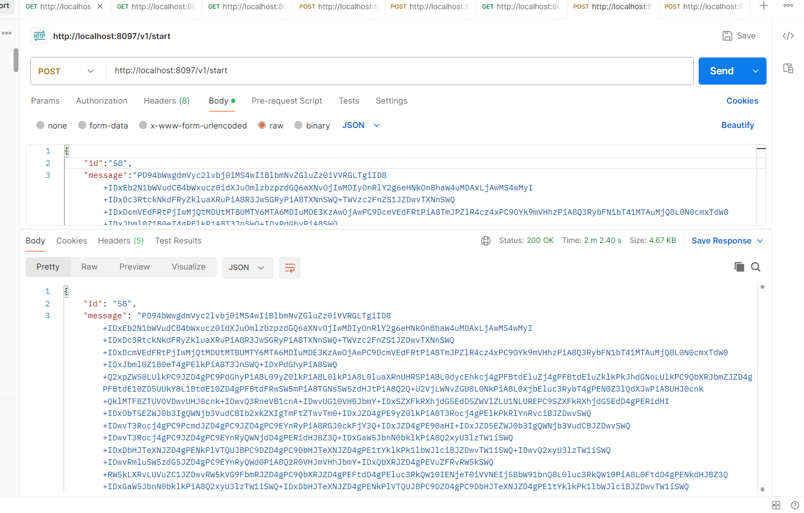
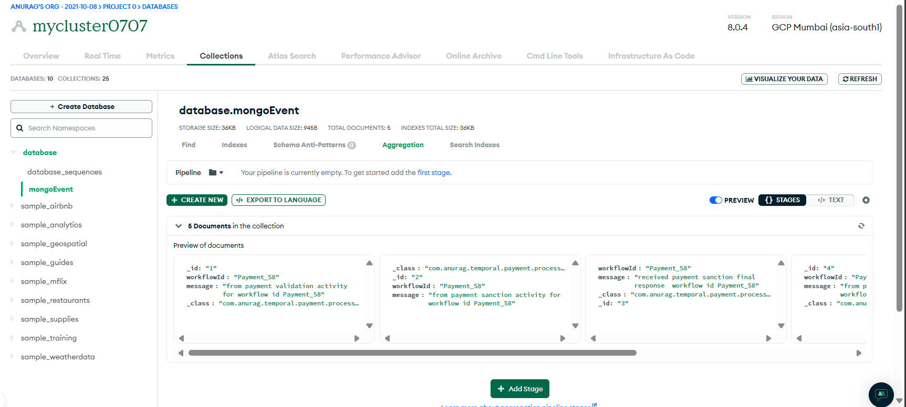
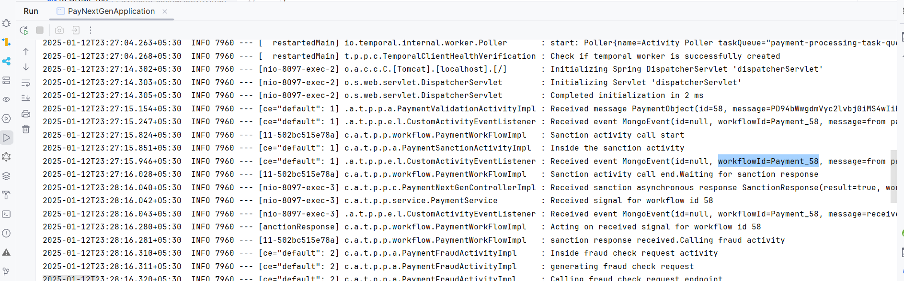
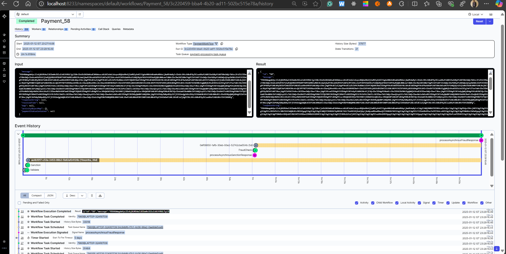
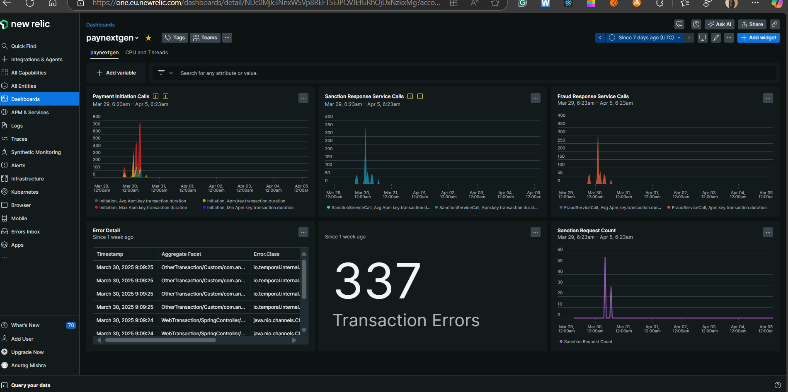
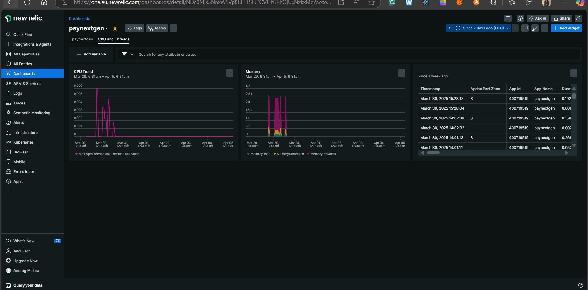
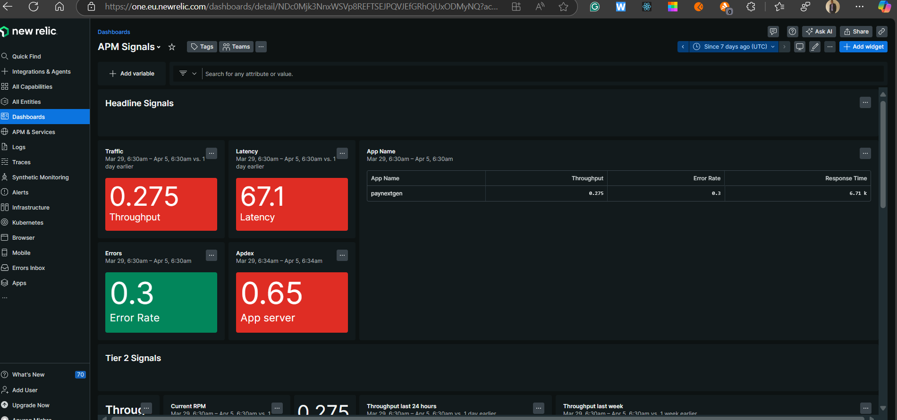
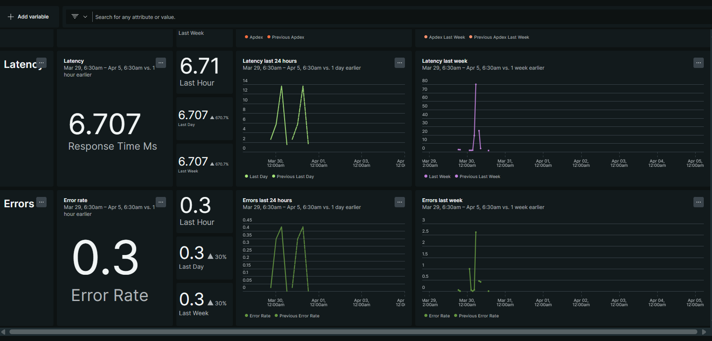
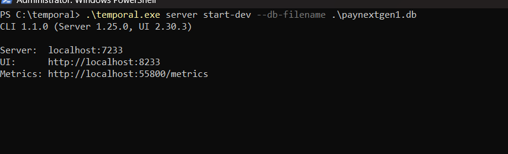

<h1 align="center">Temporal Orchestration with Spring boot</h1>
<h2 align="center">


</h2>

<p align="center">


</p>


<h2 align="center"><a  href="https://solitairevue.firebaseapp.com">Live Demo</a></h2>

### [Contributions are Welcome](https://github.com/silent-lad/VueSolitaire/blob/master/CONTRIBUTING.md)

## Description

**Screen shots of application**

<p align="center">
</p>
</p>
</p>
</p>
<p align="center"><b>Observability through new relic</b></p>
</p>
</p>
</p>
</p>

Dashboard pdf<br/>

[Signals.pdf](images%2FSignals.pdf)
Project details

**This project is inspired by temporal ** .

## How to local temporal server

</p>

### Pushing the payment [__Postman__]:-

- **Post payment** 
- **Received** 


### Simulator [__Simulator with rapidoid__]-

- **Click** .
- **Click** 
 

## About the project.

### Payment Orchestration

- **payment** goes through validation, sanction , fraud


## Project setup

```
java -javaagent:./src/main/resources/newrelic/newrelic.jar -DdbConnection="ENC(SLDS6bFc4PH/Ahph8DGKvNuSj5IuKk44kQCcjiB4F3skJT9vNxH8FnEsX1//U9jjhK0HKwPILBNO+94Dlk+90tAuVJge92eTHdQ6PmEfqDsrj/TCnfnmpdTQIM5UB7SyL0ZAlOT4YzGTbINTjxMpEBc3lkV/1UDvMg3dAcAxQCU=)" -DenableStub=N -D"newrelic.config.log_level"=finest -Dsecret=Temporal@2025 -jar -DstubThreadCount=1 ./target/paynextgen.jar
```

## Future scope

- Deploy on GKE.