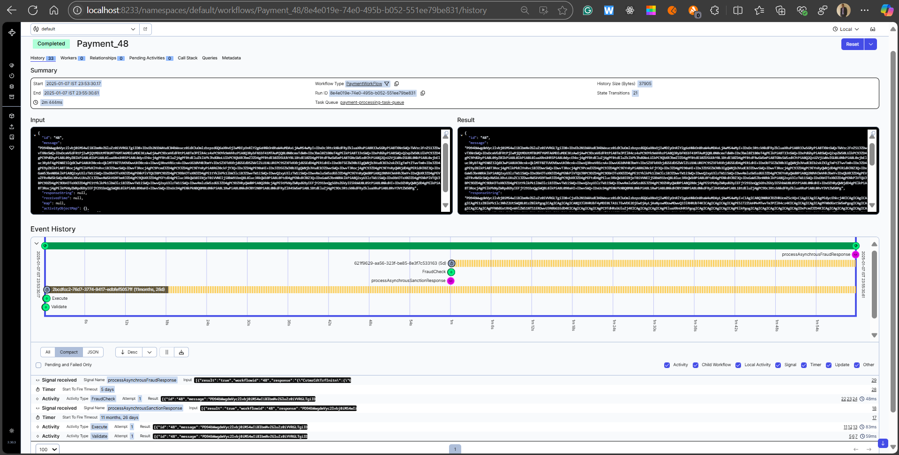

<h1 align="center">Temporal Orchestration with Spring boot</h1>
<h2 align="center">


</h2>

<p align="center">


</p>


<h2 align="center"><a  href="https://solitairevue.firebaseapp.com">Live Demo</a></h2>

### [Contributions are Welcome](https://github.com/silent-lad/VueSolitaire/blob/master/CONTRIBUTING.md)

## Description

**Screen shots of application**

<p align="center">
</p>

Project details

**This project is inspired by temporal ** .

## How to local temporal server

</p>

### Pushing the payment [__Postman__]:-

- **Drag** the card or the card pile you want to move.
- **Drop** the dragged card pile on the target and if the move is legal card will move
- Note:- Drag and Drop doesn't work for properly for **firefox** due to their lack of support to html Drag and drop API - https://bugzilla.mozilla.org/show_bug.cgi?id=505521 .

### Simulator [__Simulator with rapidoid__]-

- **Click** on the card or card pile you want to move .The pile turns to **blue**.
- **Click** on the
  destination card and if the move is legal the cards will
  stack below the target.

## About the project.

### Payment Orchestration

- **payment** goes through validation, sanction , fraud


## Project setup

```
java -jar paymentnextgen.jar
```

## Future scope

- Deploy on GKE.